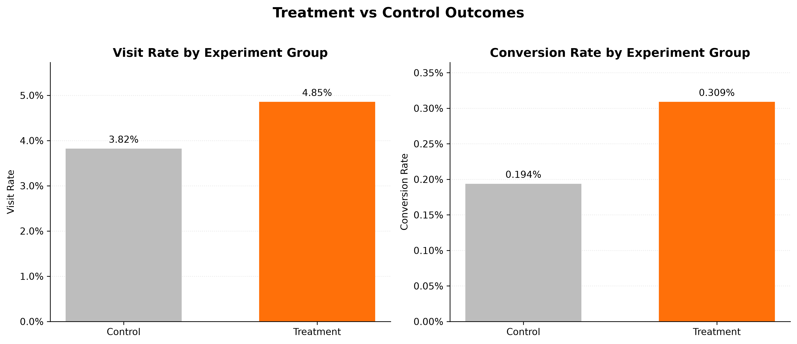
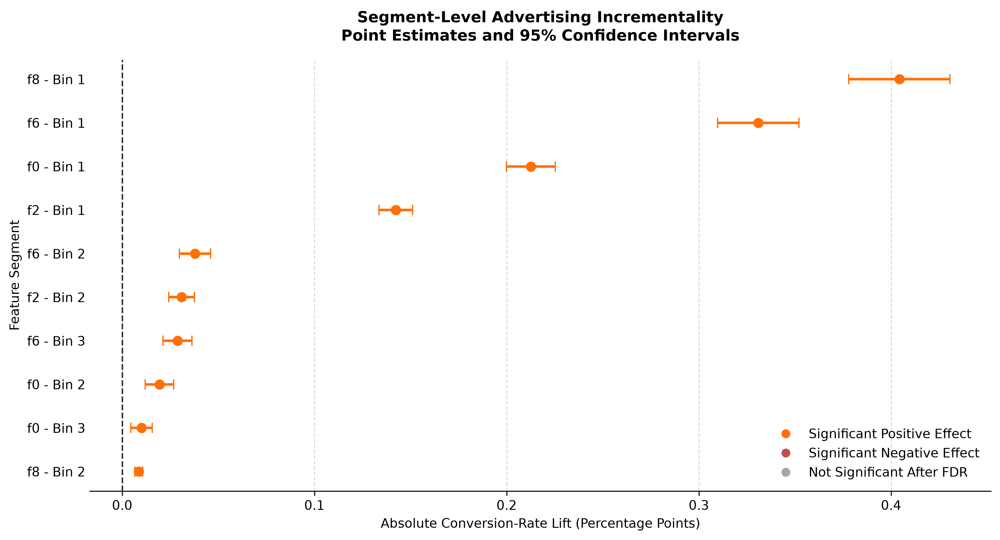
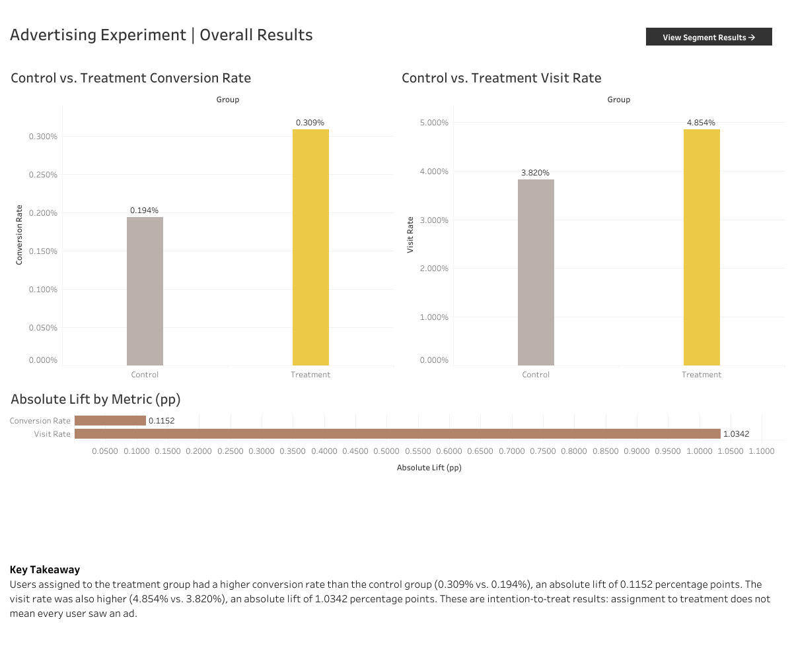
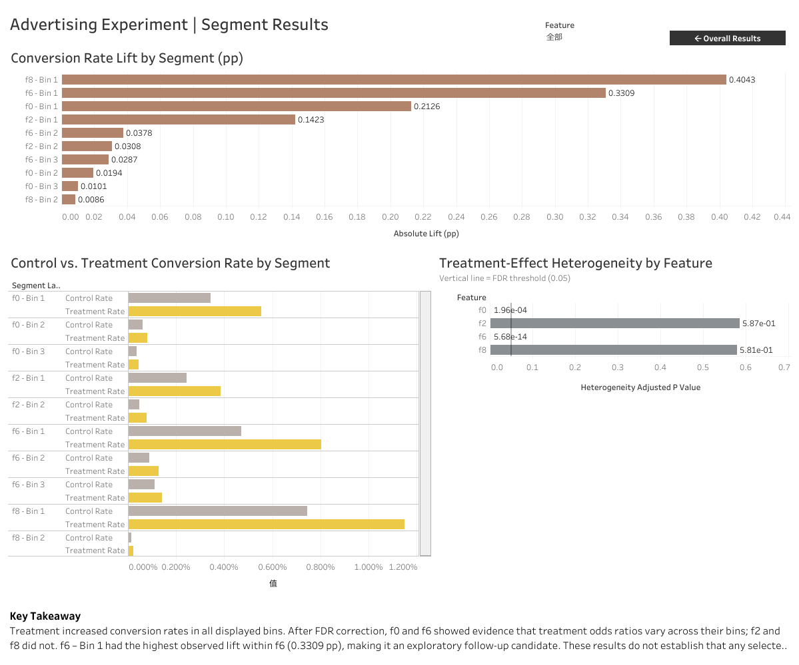

# Criteo Advertising Incrementality Analysis

This portfolio project uses the public **Criteo Uplift Prediction Dataset v2.1** to compare visit and conversion outcomes by randomized advertising assignment and explore how treatment effects vary across anonymized feature groups. The analysis was conducted in Python, with results presented in [interactive Tableau dashboards](https://public.tableau.com/app/profile/pei.chun.huang/viz/CriteoAdvertisingIncrementalityAnalysis/AdvertisingExperimentOverallResults).

> **How to interpret these results:** Criteo non-uniformly subsampled the public dataset to prevent recovery of the original incrementality level. The estimates in this project describe **the released benchmark sample**. They should not be interpreted as the impact or return on investment of Criteo’s original campaigns, or as a ready-to-use targeting policy. See the [dataset documentation](https://ailab.criteo.com/criteo-uplift-prediction-dataset/).

## Questions

1. How do website visit and conversion rates differ between randomized treatment and control assignments in the released sample?
2. How large and precise are the observed rate differences?
3. Which anonymized feature partitions show evidence that the treatment-control association varies across bins?

## Data and design

The analysis uses the Criteo Uplift Prediction Dataset (v2.1), which contains **13,979,592 observations**, 12 anonymized features (`f0`–`f11`), and four binary variables: `treatment`, `exposure`, `visit`, and `conversion`.

Download the dataset from [Criteo AI Lab](https://go.criteo.net/criteo-research-uplift-v2.1.csv.gz) and save it as `data/raw/criteo-uplift-v2.1.csv.gz` to run the notebooks. The raw dataset is not included in this repository. See the dataset page for usage terms and the requested paper citation.

The primary analysis uses **intention to treat (ITT)**: observations are compared according to `treatment`, including those assigned to treatment without recorded exposure. The comparison does not estimate the causal effect of actually seeing an ad. The control group has no recorded experimental exposure; about **3.60%** of treatment assignments have recorded exposure.

## Methods

- `01_data_understanding.ipynb`: inspect the schema, missing data, binary variables, logical consistency, and identical rows. There is no unique user ID, so identical rows are documented but not removed.
- `02_experiment_analysis.ipynb`: compute treatment and control outcome rates, absolute and relative rate lift, two-sided two-proportion z-tests, and 95% Wald confidence intervals for rate differences. Conversion is the primary outcome; visit is secondary.
- `03_segment_analysis.ipynb`: use `pd.qcut(..., q=4, duplicates="drop")` to partition usable anonymized features. Four features (`f0`, `f2`, `f6`, `f8`) yield 10 bins in total. Within-bin conversion effects are tested with two-proportion z-tests and Benjamini–Hochberg FDR correction across 10 tests. Breslow–Day tests assess odds-ratio homogeneity across bins within each feature, with FDR correction across four feature tests.

**Absolute lift** is treatment rate minus control rate. A difference of `0.00115` is about **0.115 percentage points**, not 11.5%. Estimated incremental outcomes within the released sample equal absolute lift multiplied by the number of treatment assignments; they are descriptive sample-scale counterfactual estimates, not actual observed incremental conversions in Criteo's original campaigns.

## Results from the saved notebook outputs

| Outcome | Control | Treatment | Absolute lift | Relative lift | 95% CI for absolute lift |
|---|---:|---:|---:|---:|---:|
| Visit | 3.8201% | 4.8543% | 1.0342 pp | 27.07% | 1.0056 to 1.0629 pp |
| Conversion | 0.1938% | 0.3089% | 0.1152 pp | 59.45% | 0.1085 to 0.1219 pp |

Both two-sided tests have p < 0.001. Applying the conversion-rate difference to the 11,882,655 treatment-assigned observations gives an estimate of **13,687 additional conversions** in the released sample. The same calculation gives an estimate of **122,895 additional visits**. These are estimates for the public sample, not the measured impact of Criteo's original campaigns. Lift values were calculated before rounding the rates shown in the table.

All 10 within-bin conversion-lift estimates are positive and pass the segment-test FDR correction at 0.05. After correction, feature-level Breslow–Day tests find evidence that treatment effects vary across bins of `f0` and `f6`, but not enough evidence to reach the same conclusion for `f2` or `f8`.

Among the features with evidence of heterogeneity, `f0 - Bin 1` (~0.213 pp) and `f6 - Bin 1` (~0.331 pp) have the highest observed lift within their respective features. They are **exploratory follow-up candidates**: the tests do not establish that either bin's absolute lift is greater than that of other bins. Although `f8 - Bin 1` has the highest observed lift in the chart (~0.404 pp), the feature-level test does not find sufficient evidence of heterogeneity for `f8`.

## Business recommendations

- **Test before expanding ad delivery:** Treatment assignment increased conversion and visit rates in the public sample, but the data does not show whether a broader ad rollout would be profitable.
- **Investigate promising segments:** `f0 – Bin 1` and `f6 – Bin 1` had the highest observed conversion lift within their respective features. They are candidates for further testing, not proven best audiences.
- **Define usable audiences:** The dataset’s features are anonymized, so these bins cannot directly guide a real campaign. In a follow-up experiment, define audiences the business can identify and compare a targeted strategy with a broader one while retaining randomized controls.
- **Measure business impact:** Track ad spend, conversion value, and incremental profit alongside conversion lift before making a rollout decision.


## Analysis figures

### Control vs. treatment rates



### Conversion rate lift by segment



## Tableau dashboards

The workbook uses four separate CSV data sources: `experiment_group_summary.csv`, `experiment_test_results.csv`, `segment_results_summary.csv`, and `feature_heterogeneity_results.csv`.

### Dashboard 01 — Overall Results

- **Conversion and visit rates:** Compares control and treatment conversion rates (0.194% vs. 0.309%) and visit rates (3.820% vs. 4.854%) using `experiment_group_summary.csv`.
- **Absolute lift:** Shows conversion-rate lift (0.1152 pp) and visit-rate lift (1.0342 pp) using `experiment_test_results.csv`. The chart tooltips include 95% confidence intervals.
- **Key takeaway:** Compares users according to treatment assignment (intention to treat).

### Dashboard 02 — Segment Results

- **Lift by segment:** Shows absolute conversion-rate lift across 10 feature bins using `segment_results_summary.csv`.
- **Rates by segment:** Compares control and treatment conversion rates within each bin using the same CSV.
- **Feature heterogeneity:** Shows FDR-adjusted p-values using `feature_heterogeneity_results.csv`, with a reference line at 0.05.
- **Feature filter:** Filters the two segment charts; the heterogeneity chart continues to show all four features.
- **Key takeaway:** Treats high-lift bins as candidates for further investigation, not proven best audiences.

The four CSV files remain separate Tableau data sources because they contain results at different levels of detail. Joining them could duplicate measures. Conversion and visit rates are displayed as percentages; absolute lift is displayed in percentage points (pp).

**Tableau Public:** [Explore the interactive Tableau dashboard](https://public.tableau.com/app/profile/pei.chun.huang/viz/CriteoAdvertisingIncrementalityAnalysis/AdvertisingExperimentOverallResults) 

### Overall Results



### Segment Results




## Reproduce

1. Download the released Criteo Uplift Prediction Dataset v2.1 from the [Criteo AI Lab download link](https://go.criteo.net/criteo-research-uplift-v2.1.csv.gz) and save it as `data/raw/criteo-uplift-v2.1.csv.gz`.
2. Install the Python dependencies listed in `requirements.txt`.
3. Create `data/processed/` and `outputs/figures/` if they do not already exist.
4. From the `notebooks/` directory, run `01_data_understanding.ipynb`, `02_experiment_analysis.ipynb`, and `03_segment_analysis.ipynb` in order, from top to bottom. The notebooks use paths relative to that directory.
5. Connect the generated `experiment_group_summary.csv`, `experiment_test_results.csv`, `segment_results_summary.csv`, and `feature_heterogeneity_results.csv` files in `data/processed/` to Tableau as separate data sources.

Expected repository layout:

```text
data/
  raw/                                  # Raw dataset is not included in this repository
  processed/
    experiment_business_impact.csv
    experiment_group_summary.csv
    experiment_test_results.csv
    feature_heterogeneity_results.csv
    segment_definitions.csv
    segment_results_summary.csv
notebooks/
  01_data_understanding.ipynb
  02_experiment_analysis.ipynb
  03_segment_analysis.ipynb
outputs/
  figures/                              # Figures generated by the notebooks
  tables/
    overall_results.png
    segment_results.png
tableau/                                # Tableau workbook
.gitignore
README.md
requirements.txt
```

## Limitations and next steps

- **Sample scope:** The public Criteo dataset is a selected sample. The rates and estimated additional visits and conversions describe this sample, not Criteo’s original campaigns.
- **Audience identification:** The features are anonymized, so we cannot identify people who belong to a promising segment. Segments from different features can also overlap.
- **Segment comparisons:** A significant result within a segment does not prove that it performs better than another segment. The heterogeneity tests check whether treatment effects vary across a feature’s bins, but do not directly compare every pair of bins. The 95% confidence intervals were not adjusted for selecting the bin with the highest observed lift.
- **Missing business data:** The dataset does not include ad costs, conversion values, or timestamps, so we cannot assess profitability, seasonal patterns, or long-term effects.
- **Next test:** Define an audience that can be identified in practice and compare a targeted approach with a broader one. Keep randomized control groups and track both costs and business value.

## Source and attribution

This project uses the [Criteo Uplift Prediction Dataset](https://ailab.criteo.com/criteo-uplift-prediction-dataset/) provided by Criteo AI Lab under the [CC BY-NC-SA 4.0 license](https://creativecommons.org/licenses/by-nc-sa/4.0/). The dataset is not included in this repository and must be downloaded separately.

The dataset is accompanied by the following paper, which Criteo asks users to cite: Diemert, E., Betlei, A., Renaudin, C., and Amini, M.-R. (2018). *A Large Scale Benchmark for Uplift Modeling*. AdKDD and TargetAd Workshop at KDD.

The analysis, summary tables, and visualizations in this repository were created from the dataset for a noncommercial educational portfolio. This is an independent project and is not affiliated with Criteo.
